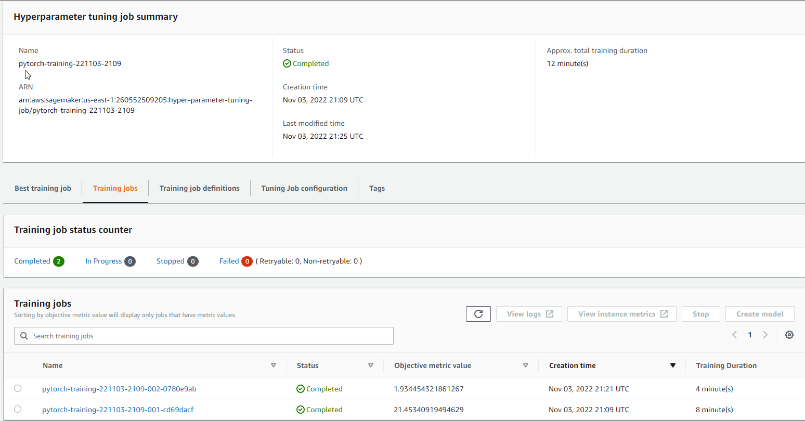

# Image Classification using AWS SageMaker
Use AWS Sagemaker to train a pretrained model that can perform image classification by using the Sagemaker profiling, debugger, hyperparameter tuning and other good ML engineering practices. This can be done on either the provided dog breed classication data set or one of your choice.

## Project Set Up and Installation
Enter AWS through the gateway in the course and open SageMaker Studio. 
Download the starter files.
Download/Make the dataset available. 

## Dataset
The provided dataset is the dogbreed classification dataset which can be found in the classroom.
The project is designed to be dataset independent so if there is a dataset that is more interesting or relevant to your work, you are welcome to use it to complete the project.

I used the provided dogbreed classification dataset.

### Access
Upload the data to an S3 bucket through the AWS Gateway so that SageMaker has access to the data. 

## Hyperparameter Tuning
What kind of model did you choose for this experiment and why? Give an overview of the types of parameters and their ranges used for the hyperparameter search
-For simplicity I chose to use resnet18.
-I used learning rate and batch size as two hyperparameters.

    hyperparameter_ranges = {
        "lr": CategoricalParameter([0.001, 0.1]),
        "batch-size": CategoricalParameter([10, 32])
    }

Remember that your README should:
- Include a screenshot of completed training jobs

- Logs metrics during the training process
- First training job

- Second training job

- Tune at least two hyperparameters
- Retrieve the best best hyperparameters from all your training jobs

    The best hyper parameters were:

         {'_tuning_objective_metric': '"average test loss"',
         'batch-size': '"10"',
         'lr': '"0.001"',
         'sagemaker_container_log_level': '20',
         'sagemaker_estimator_class_name': '"PyTorch"',
         'sagemaker_estimator_module': '"sagemaker.pytorch.estimator"',
         'sagemaker_job_name': '"pytorch-training-2022-11-03-21-09-16-647"',
         'sagemaker_program': '"hpo.py"',
         'sagemaker_region': '"us-east-1"',
         'sagemaker_submit_directory': '"s3://sagemaker-us-east-1-260552509205/pytorch-training-2022-11-03-21-09-16-647/source/sourcedir.tar.gz"'}

## Debugging and Profiling
**TODO**: Give an overview of how you performed model debugging and profiling in Sagemaker
I imported the library smdebug, and added several lines of code to ensure the debugger and profiler were set up properly.
- In `train_and_deploy.ipynb`, I added the following:  

        #imports for debugger and profiler
        import smdebug.pytorch as smd
        from sagemaker.debugger import (
          Rule,
           DebuggerHookConfig,
           rule_configs,
           ProfilerRule,
           ProfilerConfig,
           FrameworkProfile
            )
            
#### Plot of tensors

### Results
**TODO**: What are the results/insights did you get by profiling/debugging your model?  
**TODO** Remember to provide the profiler html/pdf file in your submission.  

- Based on the above plot I do not see anomalous behavior as the cross entropy loss output tensor is steadily decreasing as the training steps increase. A possible error could be a non-decreasing graph of cross entropy loss as the training steps increased.  
- See the included profiler report .pdf (profiler-report.html)
- The summary displayed here shows that there were 3 rules triggered, as well as the recommended remedies to be pursued.  

## Model Deployment
**TODO**: Give an overview of the deployed model and instructions on how to query the endpoint with a sample input.

**TODO** Remember to provide a screenshot of the deployed active endpoint in Sagemaker.

## Standout Suggestions
**TODO (Optional):** This is where you can provide information about any standout suggestions that you have attempted.
